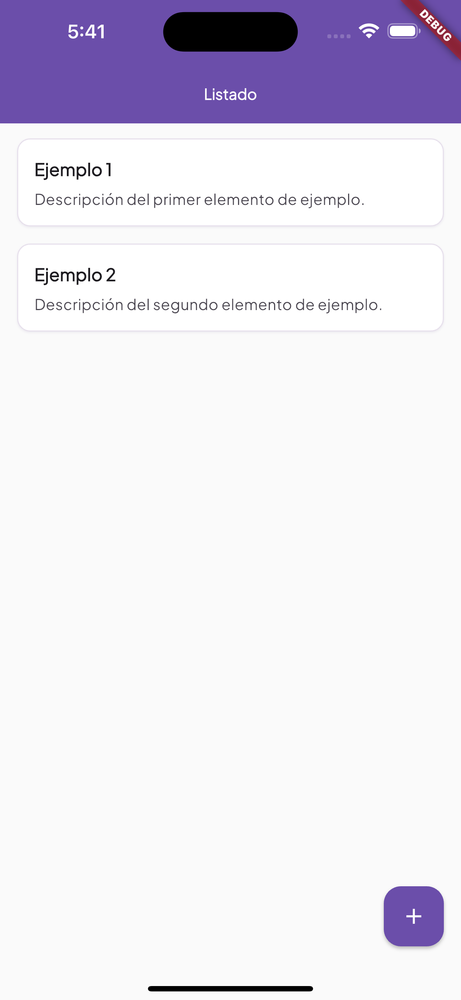
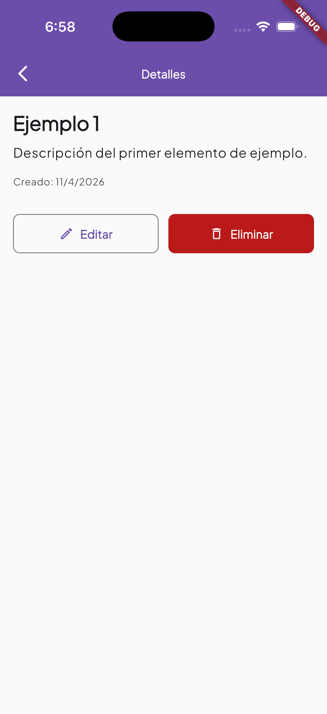
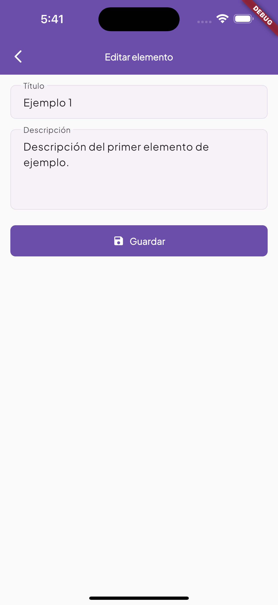

# Habilitación técnica Flutter

Aplicación en Flutter (Fase 1) y consumo de API con Dart (Fase 2). Proyecto de prueba técnica siguiendo Clean Architecture, SOLID y Clean Code.

## Fase 2 – Fake Store API (consola)

### Objetivo

Consumir al menos tres endpoints distintos de una API de tienda, modelar los datos en Dart con inmutabilidad, propagar errores con `Either` (`dartz`) y mostrar resultados legibles en consola.

### Endpoints utilizados (colección Postman)

Base principal: `https://fakestoreapi.com` (variable `baseUrl` en [FakeStoreAPI.postman_collection.json](FakeStoreAPI.postman_collection.json)).

| Recurso   | Método y ruta           |
| --------- | ----------------------- |
| Productos | `GET /products?limit=5` |
| Usuario   | `GET /users/1`          |
| Carrito   | `GET /carts/1`          |

### Respaldo

Si la base principal no responde correctamente (por ejemplo error HTTP, red o JSON no parseable como se espera), se reintenta automáticamente contra **`https://dummyjson.com`** con rutas equivalentes (`/products`, `/users/1`, `/carts/1`). Los modelos de dominio son los mismos; los mapeos JSON están separados por proveedor (`lib/data/mappers/`).

### Diseño de modelos de datos

- **Dominio** (`lib/domain/entities/`): entidades inmutables con campos `final` — `ProductEntity` (título, precio, descripción, categoría, imagen, valoración), `UserEntity` (nombre, email, usuario, teléfono), `CartEntity` + `CartLineEntity` (líneas con `productId` y `quantity`). `StoreDemoData` agrupa los tres resultados y un texto `dataSourceLabel` que indica si hubo uso del respaldo.
- **Parseo**: la deserialización vive en la capa de datos; no se expone `Map` crudo al dominio. Existen mapeadores específicos para Fake Store y para DummyJSON ante diferencias de forma (por ejemplo listas envueltas en `{ "products": [...] }` en DummyJSON).

### Solicitud HTTP y procesamiento

- Cliente `http` con cabecera `Accept: application/json` y timeout configurado en [`lib/core/constants/store_api_constants.dart`](lib/core/constants/store_api_constants.dart).
- `StoreRemoteDatasource` intenta primero Fake Store; si la petición falla o el parseo a entidades falla, se usa DummyJSON para ese mismo recurso.
- `StoreRemoteRepositoryImpl` orquesta las tres llamadas y construye `StoreDemoData`.

### Control de errores con `Either`

- Los fallos se modelan con [`Failure`](lib/domain/failures/failure.dart): `NetworkFailure`, `HttpFailure` (código distinto de 2xx), `ParseFailure`.
- Las operaciones remotas devuelven `Either<Failure, T>`; el repositorio expone `Future<Either<Failure, StoreDemoData>>`. El programa de consola usa `fold` para imprimir error o datos formateados.

### Ejecutar la demo en consola

```bash
flutter pub get
dart run bin/fake_store_demo.dart
```

La salida incluye bloques separados para productos, usuario y carrito. Los `print` están acotados al script de consola ([`bin/fake_store_demo.dart`](bin/fake_store_demo.dart)).

---

## Fase 1

Aplicación básica en Flutter con listado de elementos, pantalla de detalles y formulario para agregar o editar.

## Descripción

- **Pantalla principal (HomeScreen)**: listado de tarjetas; al tocar una se navega a detalles; botón flotante para ir al formulario de alta.
- **Pantalla de detalles (DetailsScreen)**: muestra la información del elemento; botones para editar (navega al formulario) y eliminar (con confirmación).
- **Pantalla de formulario (FormScreen)**: permite crear un nuevo elemento o editar uno existente; validación de título obligatorio; botón para guardar/agregar.

## Capturas (Fase 1)

<p align="center">
  
  
  
</p>

## Diseño de la aplicación

Se sigue **Clean Architecture** con dependencias hacia el dominio:

- **Domain**: entidad `Item` (id, title, description, createdAt) e interfaz `ItemsRepository` (lista, por id, add, update, remove). Sin dependencias de Flutter.
- **Data**: `ItemsMemoryDatasource` (lista en memoria e IDs incrementales) e `ItemsRepositoryImpl` que implementa el contrato y extiende `ChangeNotifier` para notificar cambios.
- **Presentation**: pantallas y widgets (p. ej. `ItemCard`); consumen el repositorio vía `Provider` y usan rutas nombradas con argumentos.

La **navegación** se centraliza en `AppRoutes.onGenerateRoute`: rutas `home`, `details` y `form`; los argumentos se pasan por `RouteSettings.arguments` (en detalles y formulario se usa `Item` o `Item?`).

El **estado** se mantiene en memoria mediante el repositorio inyectado con `Provider`; la UI se actualiza al llamar a `notifyListeners()` tras add/update/remove.

## Consideraciones

- La interfaz `ItemsRepository` en domain permite cambiar en el futuro la fuente de datos (persistencia, API) sin tocar la presentación.
- En detalles se vuelve a obtener el ítem por id desde el repositorio, de modo que si se editó desde el formulario y se regresó, se muestra la versión actualizada.
- Eliminar muestra un diálogo de confirmación antes de borrar.
- Lista vacía y “elemento no encontrado” (p. ej. id inválido o ya eliminado) tienen mensajes y acciones claras.

## Cómo ejecutar (app Flutter – Fase 1)

```bash
flutter pub get
flutter run
```

## Tests

```bash
flutter test
```
